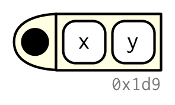

```{r setup, include=FALSE}
knitr::opts_chunk$set(echo = TRUE)
```

# Functions

This document is modified from Chapter 2 of [Advanced R](http://adv-r.had.co.nz/memory.html) by Hadley Wickham (second edition; licensed under [CC BY-NC-SA 4.0](https://creativecommons.org/licenses/by-nc-sa/4.0/).

## Why functions

By this point, you are probably already very familiar with using functions that other people have written (i.e., functions built into R and in R packages). Being able to write your own functions will help you reduce duplication in your code and isolate separate components of your data analysis workflow. This unit provides an in-depth exploration of how functions work in R.

### Example

Generate two sample datasets
```{r}
set.seed(1014) # Set seed controls random number generation, allowing for consistent results
# 1 Generate dataset with -99 as NA
df1 <- data.frame(replicate(6, sample(c(1:10, -99), 6, rep = TRUE))) 
names(df1) <- letters[1:6] # Assign column names
# 2 Generate dataset with -999 as NA
df2 <- data.frame(replicate(6, sample(c(1:10, -999), 6, rep = TRUE))) # Generate dataset
names(df2) <- letters[1:6] # Assign column names
```

Switch numeric missing values to NA
```{r}
# OPTION 1: brute force
df1$a[df1$a == -99] <- NA
df1$b[df1$b == -99] <- NA
df1$c[df1$c == -99] <- NA
df1$d[df1$d == -99] <- NA
df1$e[df1$e == -99] <- NA
df1$f[df1$f == -99] <- NA

df2$a[df2$a == -999] <- NA
df2$b[df2$b == -999] <- NA
df2$c[df2$c == -999] <- NA
df2$d[df2$d == -999] <- NA
df2$e[df2$e == -999] <- NA
df2$f[df2$f == -999] <- NA

# OPTION 2: For loops
for(column in colnames(df1)){
  fixed_values <- df1[[column]] #isolate column
  fixed_values[fixed_values== -99] <- NA #replace NAs
  df1[column] <- fixed_values
}

for(column in colnames(df2)){
  fixed_values <- df2[[column]]
  fixed_values[fixed_values== -999] <- NA
  df2[column] <- fixed_values
}

# OPTION 3: function
# Function
fix_nas <- function(df, vals) {
  for (column in colnames(df)) {
    fixed_values <- df[[column]] #Save this column as a vector
    fixed_values[fixed_values %in% vals] <- NA #Replace val with NA
    df[column] <- fixed_values #Fill in the original dataframe
  }
  df
}

fix_nas(df1, c(-99,-999))
fix_nas(df2, c(-99,-999))
```

### Function components

A function has three parts: 

* The `formals()`, the list of arguments that control how you call the function.
  
* The `body()`, the code inside the function.

* The `environment()`, the data structure that determines how the function finds 
the values associated with the names.

While the formals and body are specified explicitly when you create a function, the environment is specified implicitly, based on _where_ you defined the function. The function environment always exists, but it is only printed when the function isn't defined in the global environment.

```{r}
f02 <- function(x, y) {
  # A comment
  x + y
}

formals(f02)

body(f02)

environment(f02)
```

You can view the source code for non-primitive functions in R by printing the function as an object. The `getAnywhere()` function is helpful when you don't know which namespace a function is in.

```{r}
cor # non-primitive function

sum # primitive function

getAnywhere("cor") # alternative way of accessing source code
```

### Exercises

1. Let's practice writing functions! Write a function to calculate the standard deviation of a vector. Recall that standard deviation is the square root of the variance of the data. 

```{r}
data <- c(1, 5, 2, 6, 8, 4, 2, 6, 7)
#STEP 1: First, calculate the standard deviation of these data outside of a function (without using the built-in `sd()` function)

#STEP 2: Now, paste that code in the body of the function.
stdev <- function (data) {
  # BODY
}

#STEP 3: Run your function!
stdev(data)

#STEP 4: Confirm that this function returns the same result as the built-in sd function
stdev(data) == sd(data)
```

2. Now examine the code for the built in `sd()` function. How did your solution differ? Why?

```{r}

```

### Diagrams: functions as first-class objects

We will draw functions as in the following diagram. The black dot on the left is the environment. The two blocks to the right are the function arguments. I won't draw the body, because it's usually large, and doesn't help you understand the shape of the function.

```{r, echo = FALSE, out.width = NULL}

```

R functions are objects in their own right, a language property often called "first-class functions". 

Unlike in many other languages, there is no special syntax for defining and naming a function: you simply create a function object (with `function`) and bind it to a name with `<-`:

```{r}
f01 <- function(x) {
  sin(1 / x ^ 2)
}
```

```{r, echo = FALSE, out.width = NULL}
knitr::include_graphics("../diagrams/functions/first-class.png")
```

While you almost always create a function and then bind it to a name, the binding step is not compulsory. If you choose not to give a function a name, you get an __anonymous function__, which you can use within other functions

In R, you'll often see functions called __closures__. This name reflects the fact that R functions capture, or enclose, their environments.

### Primitive functions

There is one exception to the rule that a function has three components. Primitive functions, like `sum()` and `[`, call C code directly. 

```{r}
sum
`[` #Yes, a bracket is a function! We will talk about this more later
```

They have either type `builtin` or type `special`.

```{r}
typeof(sum) #builtin
typeof(`[`) #special
typeof(cor) #closure --> remember closure means function!
typeof() #what about f2 (created above)?
```

Primitive functions exist primarily in C, not R, so their `formals()`, `body()`, and `environment()` are all `NULL`:  

Primitive functions are only found in the base package, and they have certain performance advantages.

## Function forms

> To understand computations in R, two slogans are helpful:
>
> * Everything that exists is an object.
> * Everything that happens is a function call.
>
> --- John Chambers

While everything that happens in R is a result of a function call, not all calls look the same. Function calls come in four varieties:

* __prefix__: the function name comes before its arguments, like
  `foofy(a, b, c)`. These constitute of the majority of function calls in R.

* __infix__: the function name comes in between its arguments, like
  `x + y`. Infix forms are used for many mathematical operators, and for
  user-defined functions that begin and end with `%`.

* __replacement__: functions that replace values by assignment, like
  `names(df) <- c("a", "b", "c")`. They actually look like prefix functions.

* __special__: functions like `[[`, `if`, and `for`. While they don't have a
  consistent structure, they play important roles in R's syntax.

While there are four forms, you actually only need one because any call can be written in prefix form. I'll demonstrate this property, and then you'll learn about each of the forms in turn.

### Prefix form

The prefix form is the most common form in R code, and indeed in the majority of programming languages. Prefix calls in R are a little special because you can specify arguments in three ways:

* By position, like `help(mean)`.
* Using partial matching, like `help(top = mean)`.
* By name, like `help(topic = mean)`.

As illustrated by the following chunk, arguments are matched by exact name, then with unique prefixes, and finally by position.

```{r, error = TRUE}
k01 <- function(formal_one, formal_two, formal_three) {
  list(a = formal_one, b1 = formal_two, b2 = formal_three)
}

# Position
k01(1, 2, 3)
str(k01(1, 2, 3))

# Exact name
str(k01(2, 3, formal_one = 1))

# Partial matching (not recommended)
str(k01(2, 3, formal_o = 1))
# Partial matching fails (ambiguous)
str(k01(1, 3, formal_t = 1))
```

In general, use positional matching only for the first one or two arguments; they will be the most commonly used, and most readers will know what they are. 

Avoid using positional matching for less commonly used arguments, and never use partial matching. Unfortunately you can't disable partial matching, but you can turn it into a warning with the `warnPartialMatchArgs` option:

```{r}
options(warnPartialMatchArgs = TRUE)
x <- k01(formal_o = 1, 2, 3)
```

### Infix functions

Infix functions get their name from the fact the function name comes inbetween its arguments, and hence have two arguments. R comes with a number of built-in infix operators: `:`, `::`, `:::`, `$`, `@`, `^`, `*`, `/`, `+`, `-`, `>`, `>=`, `<`, `<=`, `==`, `!=`, `!`, `&`, `&&`, `|`, `||`, `~`, `<-`, and `<<-`. You can also create your own infix functions that start and end with `%`. Base R uses this pattern to define `%%`, `%*%`, `%/%`, `%in%`, `%o%`, and `%x%`.

Defining your own infix function is simple. You create a two argument function and bind it to a name that starts and ends with `%`:

```{r}
`%+%` <- function(a, b) {
  paste0(a, b)
}

"new " %+% "string"
```

R's default precedence rules mean that infix operators are composed left to right:

```{r}
`%-%` <- function(a, b) paste0("(", a, " %-% ", b, ")")
"a" %-% "b" %-% "c"

```

### Replacement functions 

Replacement functions act like they modify their arguments in place, and have the special name `xxx<-`. They must have arguments named `x` and `value`, and must return the modified object. For example, the following function modifies the second element of a vector: 

```{r}
`second<-` <- function(x, value) {
  x[2] <- value
  x
}
```

Replacement functions are used by placing the function call on the left side of `<-`: 

```{r}
x <- 1:10
second(x) <- 5L
x
```

I say they act like they modify their arguments in place, because, as explained in our Memory unit, they actually create a modified copy. We can see that by using our old friend `tracemem()`:

```{r, eval = FALSE}
x <- 1:10
tracemem(x)

second(x) <- 6L
```

If your replacement function needs additional arguments, place them between `x` and `value`, and call the replacement function with additional arguments on the left:

```{r}
`modify<-` <- function(x, position, value) {
  x[position] <- value
  x
}
# x is currently c(1, 6, 3, 4, 5, 6, 7, 8, 9, 10)
modify(x, 1) <- 10L
x
```

When you write `modify(x, 1) <- 10`, behind the scenes R turns it into:

```{r, eval = FALSE}
x <- `modify<-`(x, 1, 10)
```

### Special forms

Finally, there are a bunch of language features that are usually written in special ways, but also have prefix forms. These include parentheses:

* `(x)` (`` `(`(x) ``)
* `{x}` (`` `{`(x) ``).

The subsetting operators:

* `x[i]` (`` `[`(x, i) ``) 
* `x[[i]]` (`` `[[`(x, i) ``)

And the tools of control flow:

* `if (cond) true` (`` `if`(cond, true) ``)
* `if (cond) true else false` (`` `if`(cond, true, false) ``)
* `for(var in seq) action` (`` `for`(var, seq, action) ``)
* `while(cond) action` (`` `while`(cond, action)  ``)
* `repeat expr` (`` `repeat`(expr) ``)
* `next` (`` `next`() ``)
* `break` (`` `break`() ``)

Finally, the most complex is the `function` function:

* `function(arg1, arg2) {body}` (`` `function`(alist(arg1, arg2), body, env)``)

Knowing the name of the function that underlies a special form is useful for getting documentation: `?(` is a syntax error; `` ?`(` `` will give you the documentation for parentheses.

### Rewriting to prefix form

Every infix, replacement, or special form can be rewritten in prefix form. Doing so is useful because it helps you better understand the structure of the language, it gives you the real name of every function, and it allows you to modify those functions for fun and profit.

The following example shows three pairs of equivalent calls, rewriting an infix form, replacement form, and a special form into prefix form. 

```{r, eval = FALSE}
### 
x <- 1
y <- 2
#Infix form
x + y
#Prefix form:
`+`(x, y)

###
df <- data.frame(matrix(rnorm(100), ncol = 3))
#Replacement form
names(df) <- c("x", "y", "z")
#Prefix form for assignment
`names<-`(df, c("x", "y", "z")) 
df #df is unchanged, because there is really another step here
`<-`(df, `names<-`(df, c("x", "y", "z")))
```

Surprisingly, in R, `for` can be called like a regular function! The same is true for basically every operation in R.

```{r}
for(i in 1:10) print(i)
`for`(i, 1:10, print(i))
```

Because things like `+`, `(`, and `<-` are functions, what they do can be changed!

If you're ever feeling particularly evil, run the following code while a friend is away from their computer. It will introduce a fun bug: 10% of the time, it will add 1 to any numeric calculation inside the parentheses.

```{r}
`(` <- function(e1) {
  if (is.numeric(e1) && runif(1) < 0.1) {
    e1 + 1
  } else {
    e1
  }
}
replicate(50, (1 + 2))
rm("(") #Undo
```

A more useful application comes up when using functional programming tools. For example, you could use `lapply()` to add 3 to every element of a list by relying on the existing `+` function:

```{r}
lapply(list(1:3, 4:5), `+`, 3)
```

## Exiting a function

Most functions exit in one of two ways: they either return a value, indicating success, or they throw an error, indicating failure. This section describes return values (implicit versus explicit; visible versus invisible), briefly discusses errors, and introduces exit handlers, which allow you to run code when a function exits.

### Implicit versus explicit returns

There are two ways that a function can return a value:

*   Implicitly, where the last evaluated expression is the return value:

```{r}
plus_1 <- function(x) {
  x + 1
}

plus_1(2) #test
```

*   Explicitly, by calling `return()`:

```{r}
plus_1_return <- function(x) {
  output <- x + 1
  return(output)
}

plus_1_return(2) #test
```

### Errors

If a function cannot complete its assigned task, it should throw an error with `stop()`, which immediately terminates the execution of the function.

```{r, error = TRUE}
j05 <- function(input) {
  if (input<0){
    stop("Negative")
  }
  
  message("Not negative!")
  #warning("I might be an error?")
  #stop("I'm an error")
  return(log(input))
}

j05(3)
j05(-1)
log(-1)
```

An error indicates that something has gone wrong, and forces the user to deal with the problem. Some languages (like C, Go, and Rust) rely on special return values to indicate problems, but in R you should always throw an error. 

### Exit handlers

Sometimes a function needs to make temporary changes to the global state. But having to cleanup those changes can be painful (what happens if there's an error?). To ensure that these changes are undone and that the global state is restored no matter how a function exits, use `on.exit()` to set up an __exit handler__. The following simple example shows that the exit handler is run regardless of whether the function exits normally or with an error.

```{r, error = TRUE}
j06 <- function(x) {
  cat("Hello\n")
  on.exit(cat("Goodbye!\n"), add = TRUE)
  
  if (x) {
    return(10)
  } else {
    stop("Error")
  }
}

j06(TRUE)

j06(FALSE)
```

`on.exit()` is useful because it allows you to place clean-up code directly next to the code that requires clean-up:

```{r}
cleanup <- function(dir, code) {
  old_dir <- setwd(dir)
  on.exit(setwd(old_dir), add = TRUE)
  
  old_opt <- options(stringsAsFactors = FALSE)
  on.exit(options(old_opt), add = TRUE)
}
```

See Advanced R textbook for more information on errors/error handlers

### Exercises

1.  What does `write.table()` return? What would be more useful?

2.  How does the `chdir` parameter of `source()` compare to `with_dir()`? Why 
    might you prefer one to the other?

3.  Write a function that opens a graphics device, runs the supplied code, and 
    closes the graphics device (always, regardless of whether or not the 
    plotting code works).
